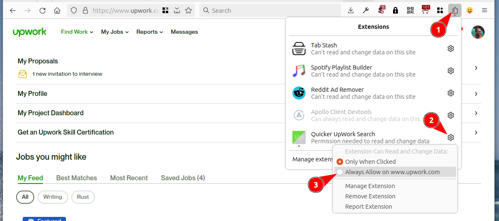
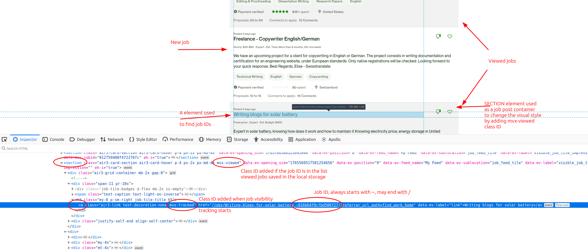

# Quicker UpWork Search

This extension greys out job posts you saw earlier as you scroll through your feed or search results on [upwork.com](https://upwork.com).

You do not need to open the job post or click on anything - the extension considers the job _viewed_ as soon as it comes into view.

For example, the same job may appear in multiple categories or searches. You can confidently skip it if the job is greyed out because you already looked at it before. This visual clue saves time scrolling through the search results and makes it less stressful.

- **new jobs** - keep their original white background
- **viewed jobs** - greyed-out

## Installation

- Chrome: https://chromewebstore.google.com/detail/quicker-upwork-search/kedmffhiekhknnfajpgjhbnalgeemhci
- Firefox: https://addons.mozilla.org/addon/quicker-upwork-search/

**Firefox users have to grant permissions to the extension after installation:**
- log into https://www.upwork.com/nx/find-work/
- click on the extensions icon in the toolbar
- click on the settings cog for this extension
- click on _Always allow on www.upwork.com_

## Technical details

Every job URL has a unique ID appended at the end. E.g. `0101cefcf75c733d23` in `https://www.upwork.com/jobs/DBA_~0101cefcf75c733d23`. The code of the extension extracts those IDs as [jobs come into view](https://developer.mozilla.org/en-US/docs/Web/API/Intersection_Observer_API) on the screen and [stores them in the browser storage](https://developer.mozilla.org/en-US/docs/Web/API/Storage). When a job with a known ID [is loaded again](https://developer.mozilla.org/en-US/docs/Web/API/MutationObserver) the code changes the b/g color of the job post section.

- no user action is required to mark the job as viewed
- the job is counted as viewed when it is scrolled into view
- the extension activates on search pages starting with https://www.upwork.com/nx/find-work/ and https://www.upwork.com/nx/search/jobs/

Only 1,000 recent job IDs are saved to keep the list of IDs small.

## Privacy

The extension does not transmit any data anywhere. It may store some data in your local browser storage. Fully open source: https://github.com/rimutaka/upwork-browser-addon/